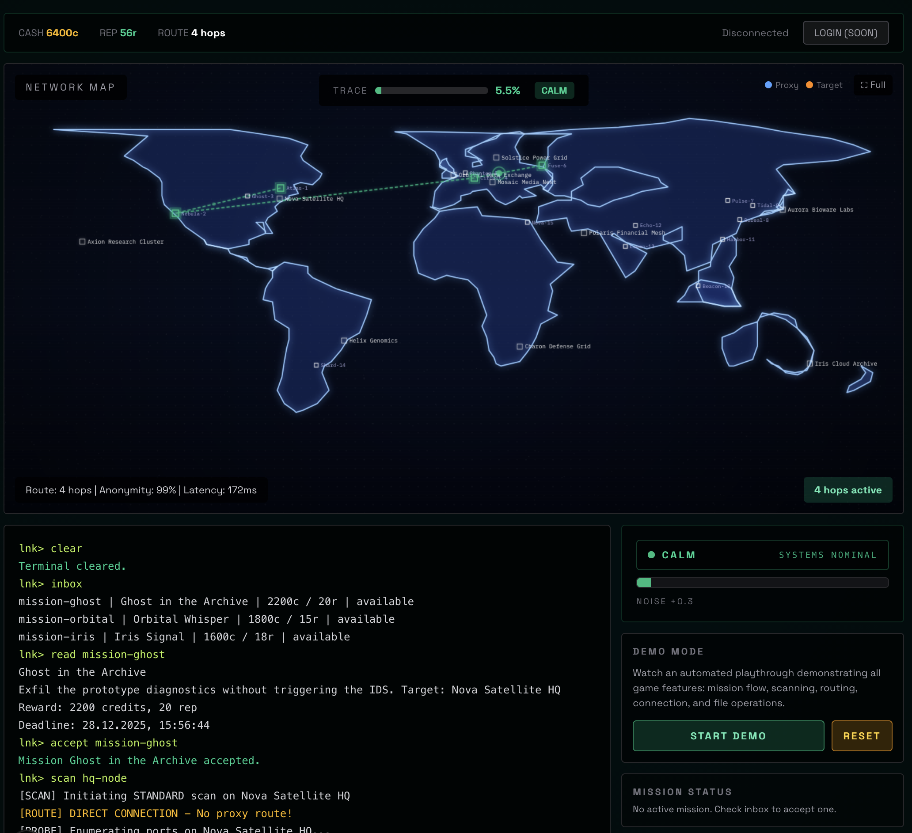

# Link26

> *A sentimental road back to Uplink times, but in 2026.*

Link26 is a browser-based hacking simulation game inspired by the classic [Uplink](https://www.introversion.co.uk/uplink/) from Introversion Software. It recreates the tension and atmosphere of being a freelance hacker navigating through proxy chains, scanning targets, and completing contracts—all from your terminal.



## Features

### 🖥️ Terminal Interface
- Typewriter effect for authentic retro feel
- Status-aware prompt: `lnk@hostname:/path [ALERT]>`
- Command history navigation
- Atmospheric system messages when connected

### 🗺️ Network Map
- World map with proxy nodes and target hosts
- Visual scan wave animation through proxy chains
- Real-time route visualization with data packets
- Click-to-add proxy routing

### 📊 Narrative Trace System
Instead of raw percentages, trace builds tension through narrative:
- **CALM** → "SYSTEMS NOMINAL"
- **ALERT** → "SUSPICIOUS ACTIVITY"  
- **HUNT** → "TRACE IN PROGRESS"
- **LOCKDOWN** → "IDENTITY COMPROMISED"

### 🎯 Missions
- Accept contracts from your inbox
- Exfiltrate data, modify files, plant evidence
- Build reputation and earn credits
- Race against trace detection

### 🔐 Proxy Routing
- Build multi-hop routes for anonymity
- Each proxy has heat, cost, and anonymity stats
- Proxies burn out with overuse
- Direct connections massively spike trace

## Commands

```
help                    Show available commands
inbox                   List open missions
accept <id>             Accept a mission
scan <host>             Scan target (triggers map animation)
connect <host>          Establish session
ls / cat / cp / rm      File operations when connected
route add <proxy>       Add proxy to route
route show              Display current route
disconnect              Drop connection (trace decays while idle)
```

## Getting Started

```bash
# Install dependencies
npm install

# Run development server
npm run dev

# Build for production
npm run build
```

Open [http://localhost:3000](http://localhost:3000) in your browser.

## Tech Stack

- **Framework:** Next.js 16 with App Router
- **State:** Zustand with IndexedDB persistence
- **Styling:** Tailwind CSS
- **Audio:** Web Audio API synthesized sounds
- **Graphics:** Canvas 2D for map, CSS for effects

## Gameplay Tips

1. **Always scan before connecting** - Direct connections without reconnaissance spike your trace massively
2. **Build a proxy route** - Never connect without at least 2-3 proxy hops
3. **Watch proxy heat** - Overused proxies burn out and become unusable
4. **Disconnect to decay** - Trace slowly decreases when you're not connected
5. **Wipe logs sparingly** - It works but creates a trace spike

## Roadmap

- [ ] Cloud save sync
- [ ] More mission types
- [ ] Hardware upgrades shop
- [ ] Multiplayer agent rankings
- [ ] Mobile responsive layout

## Credits

Inspired by **Uplink: Hacker Elite** (2001) by Introversion Software—the game that defined the hacking sim genre.

## License

MIT

---

*"Welcome back, operator. The network awaits."*
